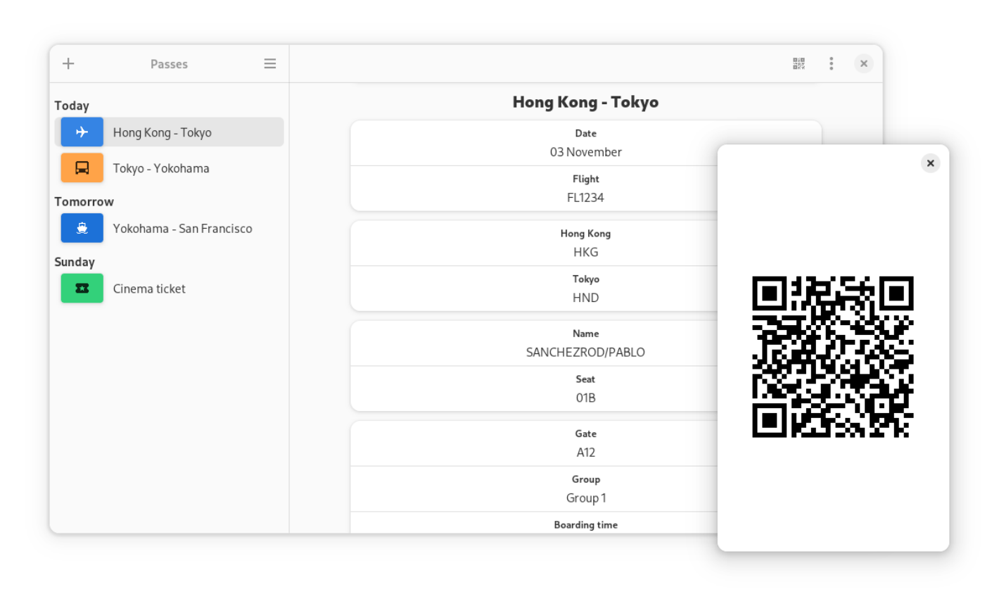

# Passes

*Passes* is a digital pass manager for the GNOME desktop, built with libadwaita.

## Features

- Adaptive user interface that works on both desktop and mobile.
- Support for `.espass` and `.pkpass` pass formats.
- Barcode display for supported passes.
- `.pkpass` update downloads.

## Install

The recommended way of installing *Passes* is via Flatpak:

 

## Build

*Passes* can be built using [GNOME Builder](https://apps.gnome.org/Builder/). Install it alongside `flatpak-builder`, then import the project and press the Run button.

## License

*Passes* is available under the terms of the [GPL 3.0](COPYING) license.
